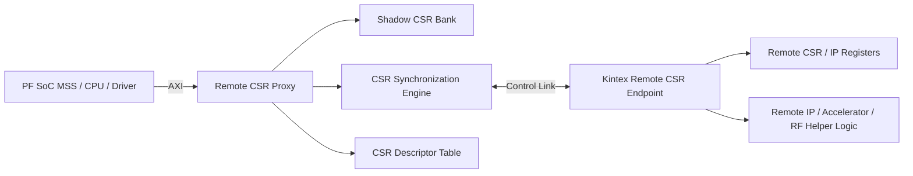
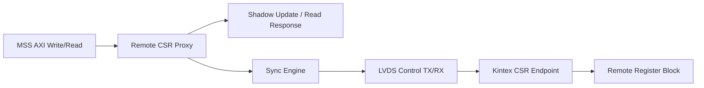
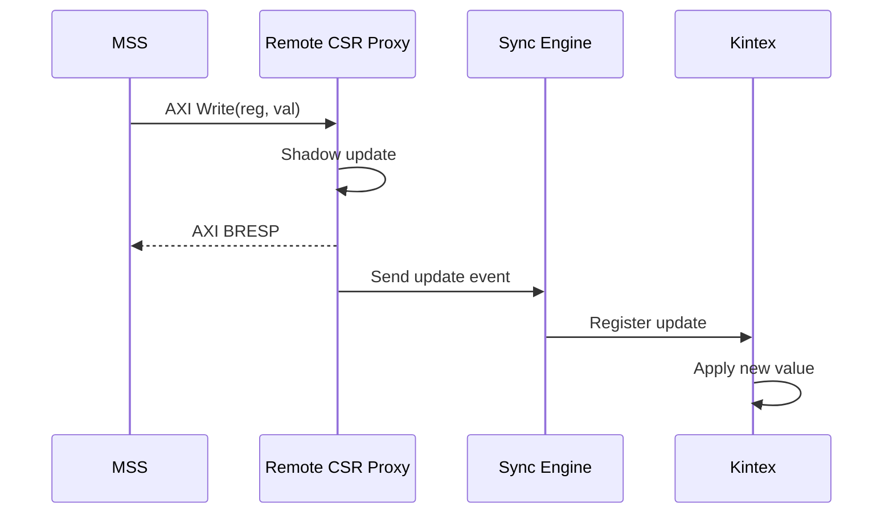
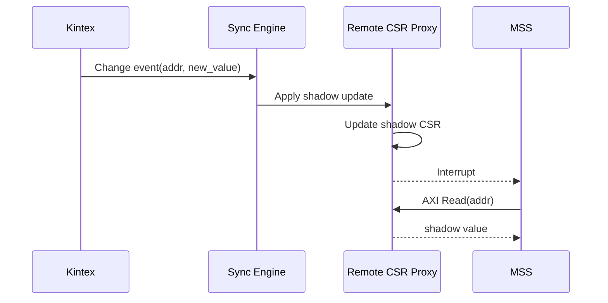
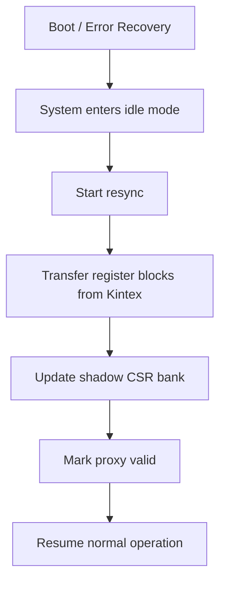

# Remote CSR Proxy Tasarımı

## 1. Amaç

Bu dokümanın amacı, **PolarFire SoC MSS üzerinden Kintex tarafındaki register tabanlı IP bloklarının yerel AXI/MMIO benzeri bir modelle yönetilebilmesi** için önerilen genel amaçlı bir kontrol mimarisini tanımlamaktır.

Hedef, ADRV9004/Navassa özelinde noktasal bir çözüm üretmek değil; bunun yerine aşağıdaki senaryolarda tekrar kullanılabilir bir altyapı tanımlamaktır:

- PF SoC MSS'in merkezi kontrol işlemcisi olduğu sistemler
- Kintex üzerinde çalışan uzak IP / accelerator / peripheral blokları
- Zynq PS-PL sürücü modeline yakın bir kullanım hissi oluşturma isteği
- Yazılmış veya yazılacak sürücülerin, mümkün olduğunca yerel AXI register erişimi mantığına yakın çalıştırılması

Bu amaçla önerilen mimari, klasik bir request/response tabanlı remote register access yapısından farklı olarak, **yerel shadow/proxy register bankası** üzerinden çalışan ve arka planda uzak register senkronizasyonu yapan bir yapı olarak ele alınmaktadır.

---

## 2. Tasarımın Kapsamı

Bu mimari aşağıdaki hedefler için uygundur:

- Register tabanlı kontrol düzlemi
- CSR (Control/Status Register) tipi IP blokları
- Uzak FPGA/IP tarafındaki register alanlarının PF SoC MSS tarafından kontrol edilmesi
- Sürücü tarafında yerel MMIO hissinin artırılması
- ADRV9004 dahil olmak üzere, benzer register arayüzlü farklı IP bloklarının ortak bir yöntemle yönetilmesi

Bu mimari şu alanlar için doğrudan "genel çözüm" olarak değerlendirilmemelidir:

- FIFO pop/read side-effect içeren data window register'ları
- Clear-on-read semantiği olan register'lar
- Genel amaçlı, tüm AXI slave davranışını birebir emüle eden uzak köprü senaryoları
- Streaming data path erişimi

Bu nedenle bu yapı **Remote AXI Controller** değil, daha doğru bir ifadeyle:

- **Remote CSR Proxy**
- **CSR Synchronization Engine**

olarak ele alınmalıdır.

---

## 3. Terminoloji

### 3.1 Remote CSR Proxy
PF Fabric üzerinde yer alan ve MSS'e yerel AXI peripheral gibi görünen, ancak içeriğinde uzak register alanının gölgelenmiş (shadowed) temsilini tutan blok.

### 3.2 Shadow CSR Bank
MSS'in doğrudan eriştiği yerel register bankası. Okuma işlemleri buradan cevaplanır. Yazma işlemleri owner ve descriptor kurallarına göre işlenir.

### 3.3 CSR Synchronization Engine
PF Fabric ile Kintex arasındaki register senkronizasyon protokolünü yöneten blok.

### 3.4 CSR Descriptor Table
Her register için owner, access type, event policy, command semantic, resync group gibi bilgileri tutan metadata tablosu.

### 3.5 Owner
Bir register'ın nihai değerinden sorumlu taraf.

- **MSS-owned register**
- **Kintex-owned register**

Ownership **register bazında tekildir**.

---

## 4. Yüksek Seviyeli Mimari

### Açıklama

- MSS yalnızca **Remote CSR Proxy** ile konuşur.
- MSS açısından register alanı yerel görünür.
- Shadow bank, okuma işlemlerini düşük gecikmeyle cevaplar.
- Uzak değişiklikler event bazlı olarak PF tarafına taşınır.
- PF tarafındaki descriptor table, her register için uygulanacak semantiği belirler.

---

## 5. Ana Bileşenler

### 5.1 PF SoC MSS
Görevleri:

- Sürücüleri çalıştırmak
- PF Fabric içindeki Remote CSR Proxy'ye AXI üzerinden erişmek
- Interrupt işlemek
- Boot sırasında descriptor table konfigürasyonu yapmak
- Hata durumunda resync/recovery başlatmak

### 5.2 PF Fabric - Remote CSR Proxy
Görevleri:

- MSS'ten gelen AXI read/write işlemlerini sonlandırmak
- Shadow CSR bank üzerinden yerel okuma/yazma davranışı sağlamak
- Descriptor tablosuna göre ownership ve access policy uygulamak
- Uzak değişiklikleri gölge bankaya işlemek
- MSS'e interrupt üretmek

### 5.3 Shadow CSR Bank
Görevleri:

- Yerel register görüntüsünü tutmak
- Read işlemlerine doğrudan yanıt vermek
- Write sonrasında yerel değeri güncellemek veya owner kuralına göre bekletmek

### 5.4 CSR Synchronization Engine
Görevleri:

- PF ↔ Kintex kontrol hattı protokolünü yürütmek
- Write/update event üretmek
- Kintex'ten gelen register update event'lerini almak
- Resync akışını yönetmek
- Hata/timeout/link durumlarını raporlamak

### 5.5 CSR Descriptor Table
Önerilen alanlar:

- `reg_addr`
- `owner` = MSS / Kintex
- `access_type` = RO / WO / RW
- `reg_type` = normal / doorbell_wo
- `notify_on_change`
- `resync_group`
- `shadow_policy`
- `stale_check_enable`
- `error_reporting_enable`

> Not: Descriptor table mantığı sabit RTL aklı yerine **MSS tarafından boot sırasında yapılandırılan politika** şeklinde ele alınmalıdır.

### 5.6 Kintex Remote CSR Endpoint
Görevleri:

- PF'den gelen register update paketlerini almak
- Uzak register alanına uygulamak
- Register değişim event'lerini PF'ye bildirmek
- Resync sırasında blok bazlı snapshot / register image aktarmak

---

## 6. Fiziksel Arayüzler

Bu dokümanın odak noktası **kontrol hattıdır**.

### 6.1 PF SoC MSS ↔ PF Fabric
- Yerel AXI erişimi
- Düşük gecikmeli, yerel register erişimi
- MSS açısından klasik MMIO görünümü

### 6.2 PF Fabric ↔ Kintex Kontrol Hattı
Mevcut fiziksel bağlantı:

- Differential LVDS `TX`
- Differential LVDS `TX_CLK`
- Differential LVDS `RX`
- Differential LVDS `RX_CLK`

Yani kontrol için:

- PF → Kintex yönü: 1 differential data pair + 1 differential clock pair
- Kintex → PF yönü: 1 differential data pair + 1 differential clock pair

Bu bağlantı, tam AXI sinyal seti taşımak için değil; **register update / register change notification / resync / error reporting** için kullanılacaktır.

### 6.3 Kontrol Linki Mantıksal Çerçevesi

---

## 7. Register Modeli

### 7.1 Ownership
Ownership **register bazında tekildir**.

Desteklenen iki temel owner tipi:

- **MSS-owned register**
- **Kintex-owned register**

Aynı register içinde split ownership yapılmayacaktır.

### 7.2 Access Type
Desteklenen temel erişim tipleri:

- `RO`
- `WO`
- `RW`

Bit-level RO/WO anlamı register içindeki alanlarda korunabilir; ancak ownership kararı register bazında ele alınır.

### 7.3 Command Register Yaklaşımı
"Write sonrası pulse üretme" davranışı olan register'lar:

- `WO`
- `reg_type = doorbell_wo`

olarak ele alınmalıdır.

Bu register'lar için:

- Shadow bank içinde yazılan değer tutulabilir
- Read semantiği anlamlı kabul edilmeyebilir
- Auto-clear zorunlu değildir
- Asıl davranış uzak tarafa iletilen yazma etkisidir

---

## 8. Temel Çalışma Senaryoları

### 8.1 Senaryo A — MSS-owned Register Write

Hedef:
MSS'in owner olduğu bir register'a yazı yazılması.

#### Akış
1. MSS AXI write yapar.
2. Remote CSR Proxy descriptor'dan register'ın MSS-owned olduğunu görür.
3. Shadow CSR Bank hemen güncellenir.
4. AXI write response MSS'e dönebilir.
5. CSR Synchronization Engine, Kintex'e register update event gönderir.
6. Kintex kendi tarafındaki register görüntüsünü günceller.

#### Özellik
- Yazma lokal olarak hızlı tamamlanır.
- MSS açısından düşük gecikmeli MMIO hissi oluşur.

---

### 8.2 Senaryo B — Kintex-owned Register Write

Hedef:
MSS'in yazdığı ancak owner'ı Kintex olan bir register.

#### Karar
Mevcut değerlendirmeye göre:

- Shadow değişebilir
- Ancak genel senaryoda **Kintex owner kabulü** esas alınır

Bu nedenle uygulanacak net politika tasarım kararı olarak sabitlenmelidir:

#### Önerilen politika
- Shadow geçici/pending olarak güncellenebilir
- Asıl commit, Kintex owner kabulü ile tamamlanır
- PF tarafında `pending/committed/error` durumu tutulmalıdır

> Değerlendirme Notu: Bu başlık hâlâ detaylandırılmalıdır. Özellikle AXI `BRESP`'in ne zaman döneceği, pending write görünürlüğü ve rollback gerekip gerekmediği netleştirilmelidir.

---

### 8.3 Senaryo C — Kintex-owned Register Change Notification

Hedef:
Kintex tarafında owner olunan bir status/config register değişir ve PF tarafına bildirilir.

#### Akış
1. Kintex register değeri değişir.
2. Kintex endpoint, PF'ye event gönderir.
3. Event içinde **register address + new value** taşınır.
4. PF tarafında shadow CSR bank güncellenir.
5. MSS'e interrupt üretilir.
6. MSS ilgili register'ı shadow bank'ten okur.

#### Özellik
- Read işlemi her zaman shadow'dan gelir.
- MSS güncel değeri interrupt sonrası okuyabilir.
- Remote read bekleme gerekmez.

---

### 8.4 Senaryo D — Command / Doorbell WO Register

Hedef:
Bir yazma işleminin uzak tarafta pulse / trigger etkisi oluşturması.

#### Yaklaşım
Bu register tipi normal RW register gibi değerlendirilmez.

- `WO`
- `reg_type = doorbell_wo`

#### Akış
1. MSS write yapar.
2. Proxy shadow'ı güncelleyebilir.
3. Sync engine write event'i Kintex'e iletir.
4. Kintex local pulse/command etkisini üretir.

#### Not
Bu register'ın yazıldıktan sonra tekrar okunması tasarımın normal kullanım senaryosu olarak hedeflenmemektedir.

> Değerlendirme Notu: Doorbell register'ların shadow'da tutulmasının debug dışındaki pratik faydası sınırlı olabilir. İstenirse future revizyonda "shadowed but unreadable" veya "write log only" yaklaşımı değerlendirilebilir.

---

### 8.5 Senaryo E — Boot / Recovery Resync

Hedef:
Sistem açılışında veya hata sonrası PF ve Kintex register görüntülerinin yeniden hizalanması.

#### Kural
Resync yalnızca:

- sistem açılışında
- hata sonrası toparlanmada
- **idle durumda**

çalıştırılır.

#### Akış
1. MSS resync komutu verir.
2. Normal operasyon durdurulur.
3. Descriptor table'daki ilgili resync group üzerinden snapshot/transfer başlatılır.
4. Kintex ilgili register bloklarını PF'ye gönderir.
5. PF shadow CSR bank günceller.
6. Resync complete event üretilir.

---

## 9. Kural Seti

### Kural 1 — Read her zaman shadow'dan döner
MSS açısından tüm read erişimleri PF tarafındaki shadow/proxy bank üzerinden cevaplanır.

### Kural 2 — Ownership register bazında tekildir
Aynı register içinde split ownership yapılmaz.

### Kural 3 — Kintex event'i her zaman `address + new_value` taşır
Sadece "register değişti" bildirimi yeterli kabul edilmez.

### Kural 4 — Command register'lar normal RW register gibi ele alınmaz
Pulse/trigger semantiği olan register'lar `doorbell_wo` olarak tanımlanır.

### Kural 5 — Resync sadece idle durumda yapılır
Normal operasyon sırasında block resync yapılmaz.

### Kural 6 — Descriptor table MSS tarafından konfigüre edilir
PF fabric sabit akıl yerine descriptor-driven policy uygular.

### Kural 7 — Hata durumu interrupt ile MSS'e bildirilir
Link, timeout, desync, remote apply failure gibi durumlar görünür olmalıdır.

---

## 10. Arayüz Davranışı ve Semantik Notlar

### 10.1 Tam MMIO İllüzyonu Hedefi
Hedef mümkün olan en yüksek MMIO hissini oluşturmaktır. Ancak bu şu anlama gelmez:

- her register semantiği kusursuz şekilde birebir uzak gerçekliği temsil eder
- her yazma anında uzak tarafla tam eşzamanlı commit edilmiş olur

Bu nedenle mimari doğru biçimde şu şekilde tanımlanmalıdır:

> "Local AXI-accessible shadowed CSR proxy for remote register blocks"

### 10.2 AXI Response Zamanlaması
Bu başlık özellikle kritik olup nihai spesifikasyonda netleştirilmelidir.

Açık konu:

- MSS-owned register için write response ne zaman verilir?
- Kintex-owned register için write response ne zaman verilir?
- Pending yazma görünürlüğü nasıl raporlanır?

> Değerlendirme Notu: Bu başlık, sürücü uyumluluğu ve debug kolaylığı açısından en kritik noktalardan biridir.

### 10.3 Stale Veri Yönetimi
Read işlemleri shadow'dan döneceği için, event gecikmesi veya link problemi durumunda shadow değeri stale olabilir.

Önerilen yardımcı status bitleri:

- `VALID`
- `STALE`
- `REMOTE_ERR`
- `RESYNC_REQUIRED`

> Değerlendirme Notu: Bu bitler register başına değilse bile en azından block/grup bazında mevcut olmalıdır.

---

## 11. Değerlendirme Gerektiren Konular

Aşağıdaki başlıklar tasarımın bir sonraki iterasyonunda ayrıca değerlendirilmelidir.

### 11.1 Kintex-owned Write Semantiği
- Shadow ne zaman güncellenecek?
- Remote accept öncesi görünür olacak mı?
- Retry / rollback gerekecek mi?

### 11.2 Descriptor Table Derinliği ve Yapısı
- Kaç register desteklenecek?
- Sabit tablo mu, runtime yüklenen tablo mu?
- Descriptor update sırasında sistem duracak mı?

### 11.3 Event Sıralaması ve Versiyonlama
- Event'ler monoton sıra numarası taşımalı mı?
- Kayıp event tespiti nasıl yapılmalı?
- Out-of-order senaryo mümkün mü?

### 11.4 Hata Yönetimi
- Link down
- CRC/protocol error
- Remote apply failure
- Descriptor mismatch
- Boot sonrası stale shadow

### 11.5 Doorbell Register Davranışı
- Shadow'da tutulacak mı?
- Read edilirse ne dönecek?
- Debug register ile ayrıştırılmalı mı?

### 11.6 Sürücü Uyumluluğu
- Mevcut Zynq sürücüleri bu yapıyı ne ölçüde doğal kabul eder?
- `readl/writel` semantiği nerede kırılır?
- Sürücü tarafında wrapper gerekir mi?

### 11.7 Performance / Throughput
- Register event hızı ne kadar olabilir?
- Interrupt fırtınası riski var mı?
- Burst update gerekli mi?

---

## 12. Önceki Yaklaşımla Karşılaştırma

### 12.1 Remote Request/Response Register Access
**Artıları**
- Remote taraf gerçek kaynak olarak korunur
- Register semantiği daha doğrudan taşınır
- Stale shadow problemi yoktur

**Eksileri**
- MSS tarafında blocking/async mekanizma gerekir
- Driver entegrasyonu daha zor olabilir
- Race condition / completion yönetimi yazılımda büyür

### 12.2 Remote CSR Proxy Yaklaşımı
**Artıları**
- MSS tarafında yerel MMIO hissi daha güçlüdür
- Reusable ve generic yapı sağlar
- ADRV9004'e özel kalmaz
- Yazılım tarafındaki request/response karmaşıklığını azaltır

**Eksileri**
- Shadow / stale / ownership semantiği dikkat ister
- Write commit modeli net tanımlanmalıdır
- Event ordering ve resync önemli hale gelir

---

## 13. Önerilen Sonraki Adımlar

Bu dokümandan sonra aşağıdaki alt dokümanlar oluşturulmalıdır:

1. **Register Descriptor Specification**
   - field tanımları
   - örnek descriptor tabloları

2. **Control Link Protocol Specification**
   - packet format
   - event format
   - resync frame yapısı
   - error code'lar

3. **Read/Write Semantic Specification**
   - MSS-owned
   - Kintex-owned
   - doorbell_wo
   - recovery behavior

4. **Interrupt and Error Handling Specification**
   - hangi olay hangi interrupt'a sebep olur
   - recovery politikası

5. **Driver Adaptation Notes**
   - Zynq PS-PL sürücü modeline yakınlık/farklar
   - wrapper gereksinimleri

---

## 14. Kısa Sonuç

Bu tasarım yaklaşımı, PF SoC MSS ile Kintex arasındaki kontrol düzlemini **uzak register erişimi** olmaktan çıkarıp, **yerel shadowed CSR proxy** modeline dönüştürmektedir.

Bu sayede:

- MSS tarafında yerel MMIO'ya yakın bir kullanım elde edilir
- ADRV9004 dahil farklı register tabanlı IP'ler ortak yöntemle yönetilebilir
- Kontrol düzlemi reusable hale gelir

Ancak tasarımın başarısı, özellikle şu noktaların disiplinli tanımlanmasına bağlıdır:

- ownership
- write commit semantiği
- event ordering
- stale veri yönetimi
- resync kuralları
- descriptor tabanlı politika yönetimi

Bu nedenle önerilen mimari uygulanabilir ve güçlüdür; fakat ancak **iyi tanımlanmış CSR semantiği ve descriptor-driven policy** ile sürdürülebilir olacaktır.
