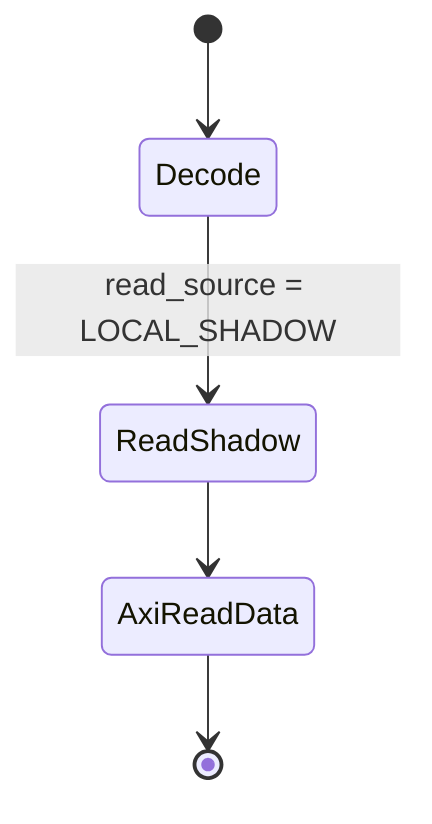
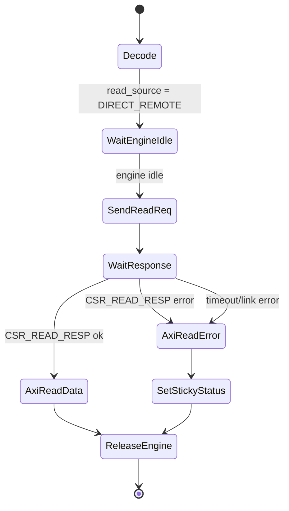
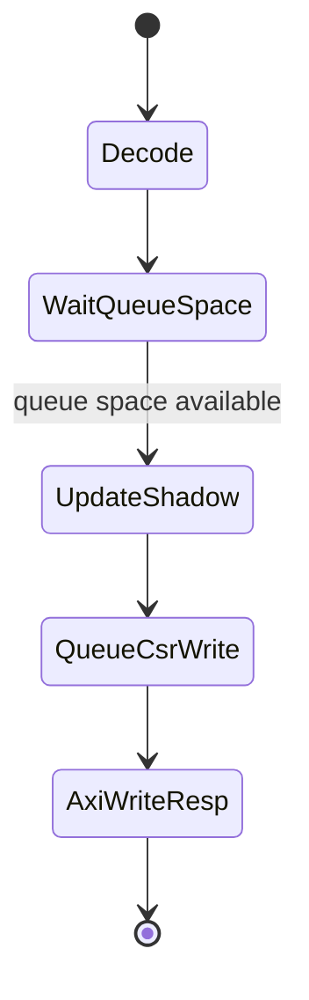
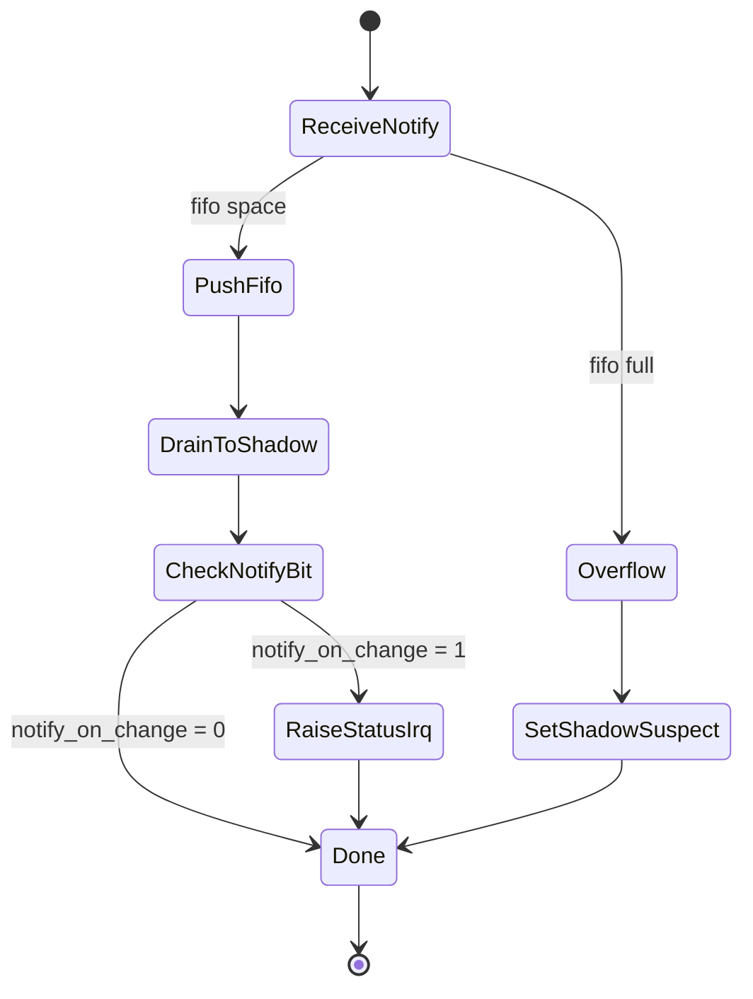

# Interface Contract (Draft) - Remote CSR Proxy v1

> Status: draft technical specification.
>
> Authority: `decision_log.md` remains binding. This document describes a
> resource-optimized v1 proposal without changing the decision log. The
> selectable direct-read behavior is a proposed refinement to the shadow-read
> baseline and remains tracked in `open_questions.md` until promoted to a
> decision-log entry.

---

## 1. Purpose and Scope

The Remote CSR Proxy presents a local AXI/MMIO-visible CSR aperture to the
PolarFire SoC MSS while synchronizing 32-bit CSR values with register endpoints
located in a remote Kintex FPGA.

This v1 contract optimizes PF Fabric resources. It is still a CSR/register-space
virtualization fabric, not a generic remote AXI slave emulator.

The binding baseline from `decision_log.md` remains:

| Topic | Current rule |
| --- | --- |
| Architecture | PF Fabric implements a policy-driven Remote CSR Proxy. |
| Read source | Normal MSS reads are served from the local Shadow CSR Bank/proxy state. |
| Update payload | Kintex-to-PF register updates carry address and new value. |
| Ownership | Ownership is per register, not per bit field. |
| Resync timing | Full/block resync is allowed only at boot, recovery, or idle. |
| Commands | Pulse-like command registers use WO / doorbell-like semantics. |
| Policy | Descriptor Table controls behavior and should be MSS-configurable where practical. |

The v1 proposal adds a descriptor-controlled exception to normal shadow reads:
MSS may mark selected registers as `DIRECT_REMOTE` read registers. A direct read
blocks the AXI read response until a commLVDS remote read response or timeout is
observed. This is intentionally limited to reads; v1 has no direct remote write
mode.

---

## 2. Resource-Optimized v1 Shape

### 2.1 Fixed Capacity and Data Width

| Parameter | v1 value |
| --- | --- |
| Register count | 256 CSRs |
| Register width | 32 bits |
| CSR stride | 4 bytes |
| Address mapping | Dense index-based map: `csr_addr = csr_base + index * 4` |
| Outstanding direct reads | 1 |
| Notification FIFO depth | 8 entries |

### 2.2 PF Fabric Blocks

| Block | v1 resource intent |
| --- | --- |
| AXI CSR decode | One shared decode path for control/status, descriptor bitmaps, and shadow aperture. |
| Shadow CSR Bank | RAM-based 256 x 32-bit storage; BRAM preferred if mapping is clean, LUTRAM acceptable. |
| Descriptor Table | Two 256-bit bitmaps: `read_source_bitmap` and `notify_on_change_bitmap`. |
| commLVDS TX request path | Shared path for shadow writes and direct read requests. |
| Direct read engine | Single FSM with one timeout counter and one outstanding transaction slot. |
| Notification path | 8-entry FIFO drained into the Shadow CSR Bank. |
| Global status | Small flop-based control/status registers for sticky errors, busy flags, interrupt state, and counters. |

The design should avoid per-register FSMs and avoid a flop bank for the full
shadow image.

---

## 3. Logical Interfaces

### 3.1 MSS to PF Fabric: Local AXI CSR Interface

The MSS accesses the Remote CSR Proxy through a local AXI slave interface.

The AXI-visible address map contains:

| Window | Purpose |
| --- | --- |
| Proxy control/status | Enable, reset, interrupt control, link status, timeout/error state, FIFO overflow, direct-read busy. |
| Descriptor bitmap programming | MSS writes/reads `read_source_bitmap` and `notify_on_change_bitmap`. |
| Event/status | Pending notification status, last notification address/value, sticky error indicators. |
| Shadow CSR aperture | 256 x 32-bit local CSR image. |

Descriptor bitmap updates are allowed only during boot, recovery, or explicit
idle/quiesced operation. They are not active-traffic operations.

### 3.2 PF Fabric to Kintex: commLVDS Logical Interface

commLVDS is assumed to be an independent two-FPGA transport that can transfer:

| commLVDS field | Meaning |
| --- | --- |
| `message_id` | Logical message type. |
| `payload_length` | Payload size in bytes or protocol-defined length units. |
| `payload` | Message-specific data. |

The Remote CSR Proxy does not define LVDS physical framing. It defines only the
logical CSR messages carried over commLVDS.

### 3.3 PF Fabric to MSS: Interrupt and Status

PF Fabric reports conditions that software cannot infer safely from normal CSR
reads:

| Condition | Minimum software visibility |
| --- | --- |
| Direct-read timeout or error | AXI error response, sticky timeout/error status, optional interrupt. |
| commLVDS link fault | Sticky link/error status, optional interrupt. |
| Remote write failure report | Asynchronous sticky error/status, optional interrupt. |
| Notification received | Shadow update, optional interrupt if enabled by `notify_on_change_bitmap`. |
| Notification FIFO overflow | Sticky overflow/error status and shadow-suspect indication. |

---

## 4. commLVDS CSR Message Semantics

All v1 CSR values are 32-bit. Address fields identify the remote CSR address or
the equivalent dense CSR address derived from the local index.

| Message | Direction | Payload | Required behavior |
| --- | --- | --- | --- |
| `CSR_WRITE` | PF to Kintex | `{addr, value32}` | Produced after an accepted AXI shadow write. Does not hold AXI `BRESP` for Kintex apply. |
| `CSR_READ_REQ` | PF to Kintex | `{addr}` | Produced for a `DIRECT_REMOTE` AXI read when the direct-read engine is free. |
| `CSR_READ_RESP` | Kintex to PF | `{addr, status, value32}` | Completes the outstanding direct read if address/status match expectations. |
| `CSR_NOTIFY` | Kintex to PF | `{addr, value32}` | Reports remote-side value change; PF updates shadow through the notification FIFO. |
| `CSR_ERROR` | Either | `{status, optional_addr}` | Reports link/protocol/apply error where available. |

`CSR_READ_RESP` may use a transaction id instead of `addr` if commLVDS provides
one, but v1 requires only one outstanding direct read, so address matching is
sufficient for the Remote CSR Proxy contract.

---

## 5. Descriptor Table v1

The v1 Descriptor Table is intentionally reduced to two bitmaps. Register
address is implied by the descriptor index.

### 5.1 Bitmap Fields

| Field | Width | Meaning |
| --- | --- | --- |
| `read_source_bitmap[255:0]` | 256 bits | `0 = LOCAL_SHADOW`, `1 = DIRECT_REMOTE`. |
| `notify_on_change_bitmap[255:0]` | 256 bits | `1 = raise notification status/interrupt when CSR_NOTIFY updates this index.` |

For register index `i`:

```text
csr_addr = csr_base + (i * 4)
```

### 5.2 Deferred Rich Descriptor Fields

The following fields from earlier drafts are deferred from v1:

| Deferred field | v1 replacement |
| --- | --- |
| `owner` | Software discipline plus shadow write propagation. |
| `access` / RO / WO / RW | All Shadow CSR Bank registers are AXI-visible 32-bit RW. |
| `semantic` | Software chooses `DIRECT_REMOTE` for side-effect-sensitive reads. |
| `shadow_policy` | Writes always update shadow; reads use `read_source_bitmap`. |
| `write_commit_policy` | Writes complete after local shadow update and commLVDS queue acceptance. |
| `event_policy` | Replaced by `notify_on_change_bitmap`. |
| `resync_group` | Deferred; v1 recovery may treat the 256-register aperture as one group unless later refined. |
| per-register error policy | Deferred; v1 uses global/sticky status with optional last address. |

### 5.3 Side-Effect Register Policy

Hardware does not enforce a special side-effect register class in v1. Side-effect
correctness is an MSS/software responsibility:

| Register behavior | v1 expected software choice |
| --- | --- |
| Normal control/status read | `LOCAL_SHADOW` unless freshness requires direct read. |
| Clear-on-read | `DIRECT_REMOTE` if the side effect must occur. |
| FIFO-pop/read-trigger | `DIRECT_REMOTE` if the side effect must occur. |
| Polling stale-sensitive status | `DIRECT_REMOTE` or local read plus explicit stale/error checks. |
| Doorbell/pulse write | Normal shadow write, producing `CSR_WRITE`; readback is software-defined. |

Selecting `LOCAL_SHADOW` for a side-effect register is allowed by v1 hardware but
may be functionally unsafe.

---

## 6. MSS Read Semantics

For a Shadow CSR aperture read, PF Fabric computes register index `i` from the
AXI address.

### 6.1 Local Shadow Read

If `read_source_bitmap[i] = 0`:

1. PF reads `shadow_ram[i]`.
2. PF returns the value on AXI `RDATA`.
3. No commLVDS read message is generated.

This is the baseline fast path and remains the default for resource-efficient
near-local MMIO behavior.

### 6.2 Direct Remote Read

If `read_source_bitmap[i] = 1`:

1. PF waits until the single direct-read engine is idle.
2. PF issues `CSR_READ_REQ(addr)` over commLVDS.
3. PF holds the AXI read response until one of these occurs:
   - matching `CSR_READ_RESP` with success,
   - matching `CSR_READ_RESP` with error status,
   - timeout,
   - commLVDS link/protocol error.
4. On success, PF returns `value32` on AXI `RDATA`.
5. On error or timeout, PF returns an AXI error response and sets sticky status.

Only one direct remote read may be outstanding. A second direct read is stalled
at the AXI interface until the direct-read engine becomes idle.

**Proposed refinement to D-003:** direct remote read is a selected exception to
the normal shadow-read policy. This remains open until recorded in
`decision_log.md`.

---

## 7. MSS Write Semantics

All v1 Shadow CSR aperture writes use the shadow/proxy path. There is no direct
remote write mode.

For an AXI write to register index `i`:

1. PF accepts the write only when the local shadow write path and commLVDS write
   queue have space.
2. PF updates `shadow_ram[i]` with the 32-bit AXI write value.
3. PF queues `CSR_WRITE(addr, value32)` to Kintex.
4. PF returns AXI `BRESP` after local shadow update plus queue acceptance.
5. PF does not wait for Kintex to apply the write.

If the write queue is full, PF stalls write acceptance. No shadow update occurs
before queue acceptance.

If Kintex later reports a write/apply failure through `CSR_ERROR`, PF records it
as asynchronous sticky status and may interrupt MSS. AXI write completion must
not be interpreted as proof that Kintex has already applied the write.

---

## 8. Kintex Notification Semantics

Kintex sends `CSR_NOTIFY(addr, value32)` when a remote-side CSR value changes.

On receipt:

1. PF validates that `addr` maps into the 256-register aperture.
2. PF pushes the notification into the 8-entry notification FIFO.
3. PF drains the FIFO into `shadow_ram[index]`.
4. If `notify_on_change_bitmap[index] = 1`, PF records notification status and
   raises an interrupt if enabled.
5. PF updates optional last-notification address/value status.

If the FIFO overflows, PF sets sticky overflow/error status and marks shadow
state suspect. Software is expected to recover with boot/recovery/idle resync.

Notification FIFO ordering is preserved for accepted entries. If entries are
lost due to overflow, the affected shadow state is not reliable until recovery.

---

## 9. Resync Semantics

Full or block resync remains allowed only during boot, recovery, or explicitly
idle conditions.

For v1, the default resource-optimized interpretation is that the 256-register
aperture is one recovery group unless a later design iteration adds resync group
metadata.

Required lifecycle:

1. MSS or recovery logic enters idle/quiesced state.
2. PF blocks new conflicting AXI accesses for the affected aperture if needed.
3. PF requests or receives a snapshot of address/value pairs from Kintex.
4. PF validates each address and updates `shadow_ram[index]`.
5. PF marks the aperture valid when the snapshot completes.
6. PF reports completion or failure to MSS.

Resync is not a normal live coherency mechanism.

---

## 10. Ordering and Coherency

| Rule | v1 contract |
| --- | --- |
| Local reads | Return current PF shadow RAM value. |
| Direct reads | Return the remote response value or AXI error; only one in flight. |
| Writes | Shadow update and `CSR_WRITE` queue acceptance happen before AXI `BRESP`. |
| Remote write apply | Not ordered with AXI `BRESP`; failures are asynchronous. |
| Notifications | Accepted FIFO entries update shadow in FIFO order. |
| Interrupt timing | Notification-driven interrupt/status is raised after the shadow update is applied. |
| Descriptor bitmap updates | Boot/recovery/idle only; not active-traffic updates. |

Software must use direct reads or explicit status checks when freshness matters.
Polling a local shadow value alone does not prove commLVDS link health or remote
hardware progress.

---

## 11. Status and Error Model

At minimum, PF Fabric exposes global/status-window indicators for:

| Status | Meaning |
| --- | --- |
| `LINK_UP` | commLVDS link/protocol layer is usable. |
| `DIRECT_READ_BUSY` | Single direct-read engine has an outstanding read. |
| `DIRECT_READ_TIMEOUT` | A direct remote read timed out. |
| `DIRECT_READ_ERR` | Direct read completed with remote/protocol error. |
| `WRITE_QUEUE_FULL` | Write acceptance is stalled because the commLVDS write queue is full. |
| `REMOTE_WRITE_ERR` | Kintex reported a write/apply error asynchronously. |
| `NOTIFY_PENDING` | Notification FIFO contains entries or pending notification status exists. |
| `NOTIFY_OVERFLOW` | Notification FIFO overflowed; shadow state may be suspect. |
| `SHADOW_SUSPECT` | Software should recover/resync before relying on local shadow. |
| `LAST_ERR_ADDR` | Optional last address associated with timeout/error/overflow. |

Per-register status is not required in v1.

---

## 12. State Diagrams

### 12.1 Local Shadow Read



### 12.2 Direct Remote Read



### 12.3 Shadow Write



### 12.4 Notification Update



---

## 13. Driver Compatibility Boundaries

The intended software model is "near-local MMIO with selectable direct reads,"
not transparent remote hardware identity.

| Driver assumption | v1 compatibility |
| --- | --- |
| Normal `readl` of stable control/status | Compatible through `LOCAL_SHADOW`. |
| Stale-sensitive polling | Use `DIRECT_REMOTE` or check stale/error/link status. |
| Read-side-effect register | Use `DIRECT_REMOTE`; local shadow reads do not trigger remote side effects. |
| Normal `writel` control update | Compatible; write updates shadow and queues `CSR_WRITE`. |
| Write completion means remote apply | Not compatible; remote apply failure is asynchronous. |
| Direct remote write | Not supported in v1. |

---

## 14. Items Still Not Frozen

The following remain open design topics and should be refined in
`open_questions.md` or promoted into `decision_log.md` before RTL freeze:

| Topic | Tracking |
| --- | --- |
| Whether selectable direct reads should revise D-003 | OQ-012 |
| Minimal bitmap descriptor schema and programming model | OQ-003, OQ-012 |
| Direct-read timeout value and AXI error response encoding | OQ-012 |
| commLVDS wire framing, retry, and link-level error behavior | OQ-009 |
| Notification FIFO overflow recovery details | OQ-005, OQ-006, OQ-012 |
| Whether later revisions need rich descriptors or per-register status | OQ-003, OQ-011 |
