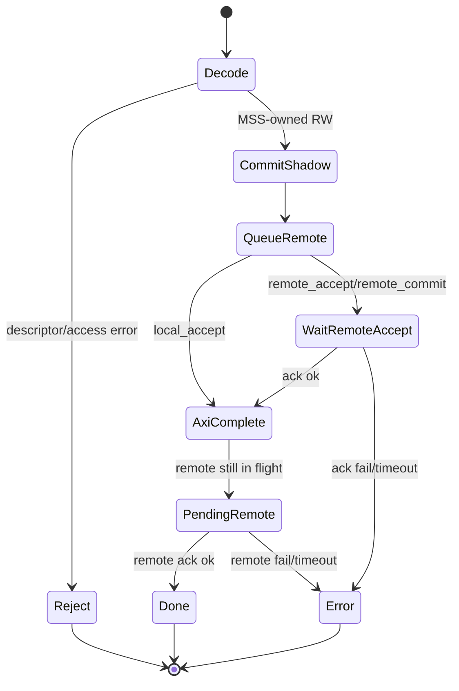
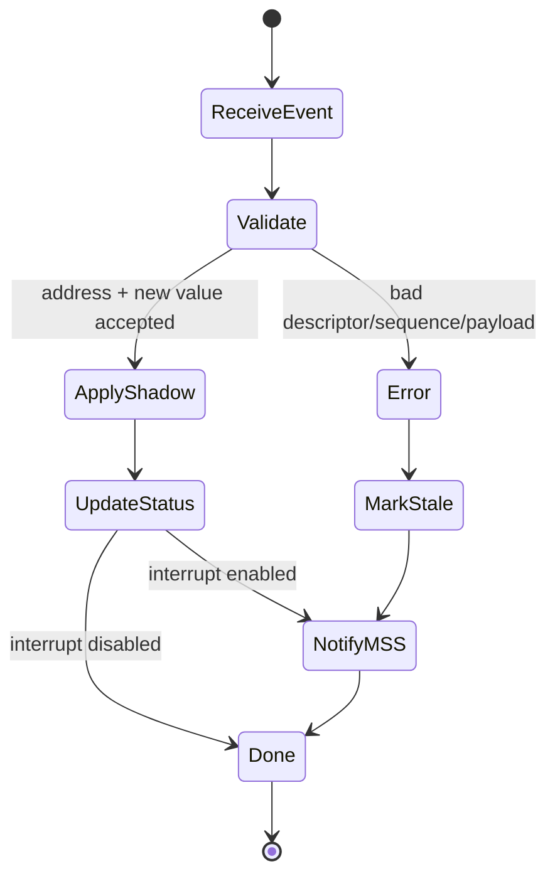
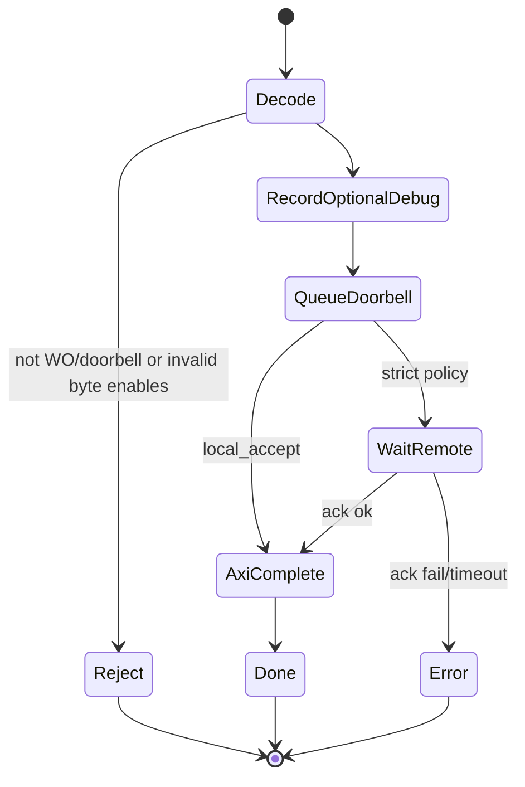
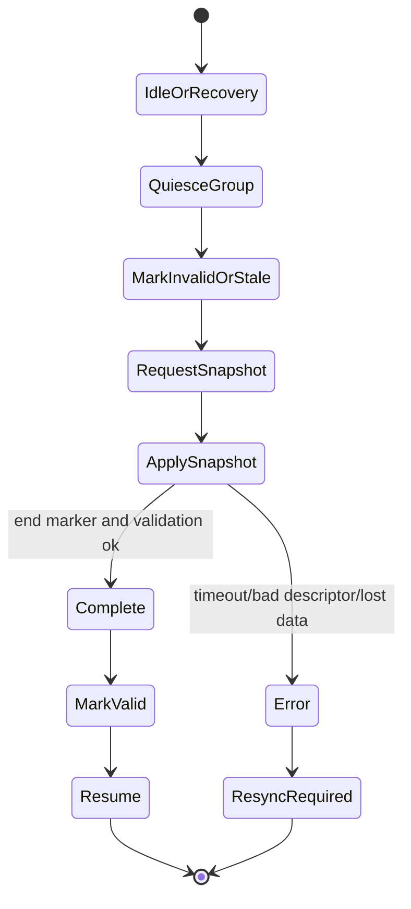

# Interface Contract (Draft) - Remote CSR Proxy

> Status: draft technical specification.
>
> Authority: `decision_log.md` remains binding. This contract refines interface
> behavior without changing the recorded decisions. Any item marked
> **Open policy** must remain tracked in `open_questions.md` until promoted to a
> decision-log entry.

---

## 1. Purpose and Scope

The Remote CSR Proxy presents a local AXI/MMIO-visible CSR aperture to the
PolarFire SoC MSS while synchronizing selected register state with CSR endpoints
located in a remote Kintex FPGA.

This contract specifies register-space virtualization behavior only. It does not
define a generic remote AXI slave emulator, a streaming data path, or a faithful
transport of arbitrary AXI side effects.

The normative baseline is:

| Topic | Current rule |
| --- | --- |
| Architecture | PF Fabric implements a policy-driven Remote CSR Proxy. |
| Read source | MSS reads are served from the local Shadow CSR Bank/proxy state. |
| Update payload | Kintex-to-PF register updates carry address and new value. |
| Ownership | Ownership is per register, not per bit field. |
| Resync timing | Full/block resync is allowed only at boot, recovery, or idle. |
| Commands | Pulse-like command registers use WO / doorbell-like semantics. |
| Policy | Descriptor Table controls behavior and should be MSS-configurable where practical. |

---

## 2. Logical Interfaces

### 2.1 MSS to PF Fabric: Local AXI CSR Interface

The MSS accesses the Remote CSR Proxy through a local AXI slave interface.

The AXI-visible address map is divided into at least these logical windows:

| Window | Purpose |
| --- | --- |
| Proxy control/status | Global enable, reset, interrupt control, link status, stale/error summary, resync trigger/status. |
| Descriptor programming | MSS-programmed Descriptor Table load/readback interface. |
| Event/status | Event queue/status, last update address/value, sticky error reporting, optional per-group counters. |
| Shadow CSR aperture | Local proxy image of remote CSR blocks. |

AXI reads and writes are terminated by PF Fabric. Normal MSS reads of proxied
CSRs do not become remote read transactions during active operation.

**Open policy:** exact AXI `BRESP`/`RRESP` behavior for rejected accesses,
stale reads, strict remote completion, and unsupported register classes remains
open under OQ-001, OQ-002, and OQ-004.

### 2.2 PF Fabric to Kintex: Remote Control Link

The PF-to-Kintex link carries logical CSR synchronization traffic:

| Message class | Direction | Minimum payload |
| --- | --- | --- |
| Write/update request | PF to Kintex | target address, write value, byte enables or width, descriptor/context id if used |
| Doorbell request | PF to Kintex | target address, command value, command flags if used |
| Register update event | Kintex to PF | target address, new value |
| Write acknowledgment | Kintex to PF | request id or ordered acknowledgment, status/error code |
| Resync request | PF to Kintex | resync group/range id |
| Resync data | Kintex to PF | target address, value, group/range id, end marker |
| Link/error report | either | error code, affected group/address where known |

**Open policy:** packet format, retries, batching, sequence numbering,
capability negotiation, and exact acknowledgment semantics remain open under
OQ-005 and OQ-009.

### 2.3 PF Fabric to MSS: Interrupt and Status Interface

PF Fabric reports conditions that software cannot infer safely from shadow reads:

| Condition | Minimum software visibility |
| --- | --- |
| Kintex-originated update | event pending interrupt/status, updated shadow value visible before interrupt assertion |
| Remote write failure | sticky error/status, affected address or group where available |
| Link fault | interrupt/status, stale/resync-required indication for affected groups |
| Event overrun/lost sequence | sticky error/status, resync-required indication |
| Resync completion/failure | status and optional interrupt |

The status interface must make shadow validity observable at least per register
group. Per-register visibility is allowed but not required by the current
decision log.

---

## 3. Descriptor Table

The Descriptor Table is the policy metadata used by the Remote CSR Proxy before
accepting or applying an MSS access, Kintex event, or resync update.

### 3.1 Descriptor Granularity

Each descriptor covers either one register or a naturally aligned register
range/group. Ownership remains per register. If a range descriptor is used, all
registers in that range must share the same ownership and semantic class, or the
implementation must provide a deterministic sub-entry override.

**Assumption, not final decision:** descriptors are loaded by MSS during boot or
recovery and are not modified while the affected group is active.

### 3.2 Proposed Descriptor Fields

| Field | Required | Meaning |
| --- | --- | --- |
| `valid` | Yes | Entry participates in descriptor lookup. Invalid entries cause an unmapped/access error. |
| `base_addr` | Yes | Base address in the Shadow CSR aperture or remote CSR address domain, depending on address-map convention. |
| `addr_mask` / `limit` | Yes for ranges | Defines the register or range covered by the descriptor. Single-register entries may use zero mask/length. |
| `width` | Yes | Register width in bits or bytes. Used for byte-enable validation and packet sizing. |
| `owner` | Yes | `MSS` or `KINTEX`. Defines the authoritative side for the register value. |
| `access` | Yes | `RO`, `WO`, or `RW` MSS-visible access class. |
| `semantic` | Yes | Register semantic class: `normal`, `status_ro`, `doorbell_wo`, `reserved`, or `unsupported`. |
| `shadow_policy` | Yes | How the Shadow CSR Bank is updated and exposed: `commit_local`, `commit_on_remote`, `event_only`, `last_write_debug`, or `invalid_read`. |
| `write_commit_policy` | Yes | MSS write completion mode candidate: `local_accept`, `remote_accept`, `remote_commit`, or `reject`. See OQ-001. |
| `event_policy` | Yes | Whether Kintex update events are expected, optional, interrupting, coalesced, or ignored for this entry. |
| `resync_group` | Yes | Group id used by boot/recovery/idle resync flows. |
| `error_policy` | Yes | Access violation, timeout, stale-read, and remote-error reporting behavior. |
| `order_domain` | Recommended | Ordering domain for writes/events that must be observed in sequence relative to each other. |
| `reset_value` | Optional | Initial shadow value before first valid resync/event, if a deterministic reset image is valid. |
| `wstrb_mask` | Optional | Byte lanes or bits that may be modified by MSS writes. Does not create split ownership. |
| `event_threshold` | Optional | Coalescing or interrupt threshold for high-rate update sources. |
| `capability_flags` | Optional | Implementation-specific support flags, such as strict ack support or per-register stale status. |

### 3.3 Descriptor Constraints

| Constraint | Rationale |
| --- | --- |
| `owner` is single-valued for each register. | Preserves D-005 and avoids merge ownership. |
| `doorbell_wo` must use `access = WO`. | Preserves D-007 and avoids meaningful readback expectations. |
| Clear-on-read and FIFO-pop side effects should be `unsupported` unless explicitly modeled later. | Avoids pretending shadow reads can preserve remote side effects. |
| `event_only` shadow policy is natural for Kintex-owned RO/status registers. | Kintex remains authoritative. |
| Descriptor changes for an active group require quiesce/disable/resync. | Prevents policy changes racing in-flight writes/events. |

---

## 4. Register Semantic Taxonomy

### 4.1 Ownership Classes

| Class | Authoritative value source | Normal update path |
| --- | --- | --- |
| MSS-owned | MSS write accepted by PF policy | MSS write updates shadow, then PF propagates to Kintex. |
| Kintex-owned | Kintex endpoint/IP | Kintex event or resync updates shadow. MSS writes, if allowed, are requests and not authoritative commits. |

### 4.2 MSS-Visible Access Classes

| Access | MSS read | MSS write |
| --- | --- | --- |
| `RO` | Returns shadow/proxy value subject to validity policy. | Rejected or ignored according to `error_policy`. |
| `WO` | No meaningful architectural readback. | Accepted only if semantic policy allows. |
| `RW` | Returns shadow/proxy value. | Processed according to ownership and commit policy. |

### 4.3 Semantic Classes

| Semantic | Intended use | Shadow meaning |
| --- | --- | --- |
| `normal` | Configuration/control register without read side effects. | Current proxy value, subject to stale status. |
| `status_ro` | Kintex-produced status or measurement register. | Last valid event/resync value. |
| `doorbell_wo` | Command/pulse trigger. | Not architectural state; optional last-write debug only. |
| `reserved` | Address hole reserved for future use. | No valid CSR state. |
| `unsupported` | Register semantics not safely virtualized. | Access should be rejected or reported. |

---

## 5. MSS Read Semantics

All normal MSS reads from the Shadow CSR aperture are satisfied locally by the
Remote CSR Proxy.

| Register class | Read behavior |
| --- | --- |
| MSS-owned `RW` | Return the current shadow value. If remote propagation is pending or failed, expose that through status. |
| Kintex-owned `RW` | Return the last committed Kintex-authoritative value, unless a descriptor-selected pending overlay is explicitly exposed. |
| Kintex-owned `RO` / `status_ro` | Return the last event/resync value if valid. If stale/invalid, behavior is selected by `error_policy`. |
| `WO` / `doorbell_wo` | Readback is not meaningful. Recommended default is a deterministic value plus status/error reporting, but exact `RRESP` policy is open. |
| `reserved` / `unsupported` | Return an access error or deterministic reserved value according to `error_policy`. |

The proxy must not hide invalid or stale state silently. At minimum, affected
groups must expose `VALID`, `STALE`, `REMOTE_ERR`, or `RESYNC_REQUIRED` style
state through the proxy status window.

**Open policy:** whether stale reads are always allowed, blocked, or faulted for
selected descriptors remains open under OQ-002.

---

## 6. MSS Write Semantics

### 6.1 MSS-Owned Registers

For an MSS-owned `RW` register:

1. PF Fabric performs descriptor lookup and access validation.
2. Shadow CSR Bank is updated with the MSS write value, masked by legal byte
   enables if supported.
3. The CSR Synchronization Engine queues a PF-to-Kintex write/update message.
4. MSS write completion follows `write_commit_policy`.
5. Remote acknowledgment/failure updates pending/error status.

Recommended conservative interpretation:

| Completion mode | Meaning |
| --- | --- |
| `local_accept` | AXI write completes after local shadow update and queue acceptance. Remote failure is reported asynchronously. |
| `remote_accept` | AXI write completes after Kintex endpoint accepts the request. |
| `remote_commit` | AXI write completes after Kintex reports the remote CSR effect committed. |

`local_accept` preserves the strongest local-MMIO feel but increases the need for
visible pending/error status.

### 6.2 Kintex-Owned Registers

For a Kintex-owned `RW` register:

1. PF Fabric performs descriptor lookup and access validation.
2. MSS write is treated as a request to the Kintex owner, not as an
   authoritative local commit.
3. PF queues a write/request message to Kintex if the descriptor permits it.
4. Shadow commit should occur only after Kintex accepts/commits the value or
   sends a normal address/value update event.
5. Pending state should be visible to MSS if the write response can complete
   before authoritative shadow commit.

This preserves per-register ownership and avoids silently overwriting a
Kintex-owned value with a local speculative value.

**Open policy:** whether a temporary pending overlay may be read back before
Kintex confirmation remains open under OQ-001 and OQ-008.

### 6.3 RO Registers

For `RO` registers, MSS writes are access violations unless an explicit
descriptor policy defines them as ignored compatibility writes.

**Open policy:** integration/debug builds may prefer error responses, while
driver-compatibility builds may prefer OKAY-ignore behavior. The exact default
is not frozen.

### 6.4 WO / Doorbell Registers

For `WO` / `doorbell_wo` registers:

1. PF Fabric validates the descriptor and write value/byte enables.
2. PF queues a doorbell request to Kintex.
3. Shadow state is not architectural. PF may record last write value for debug.
4. Doorbell completion follows `write_commit_policy`.
5. Doorbell replay after retry or recovery must be explicitly controlled to
   avoid duplicate remote command effects.

Doorbell registers do not require auto-clear semantics unless a future
decision-log entry adds that behavior.

### 6.5 RW Registers

For `RW` registers, the owner determines commit authority:

| Owner | Write authority | Shadow commit rule |
| --- | --- | --- |
| MSS | MSS write is authoritative after PF accepts it under descriptor policy. | Usually commit local, then propagate. |
| Kintex | MSS write is a request to owner. | Commit on Kintex accept/update, or expose pending separately if selected. |

---

## 7. Kintex-Originated Update Semantics

Kintex-originated register update events must carry at least address and new
value.

On receipt:

1. PF validates framing, descriptor match, width, and allowed event policy.
2. PF applies the new value to the Shadow CSR Bank before notifying MSS.
3. PF updates validity/stale/error metadata for the affected descriptor or
   resync group.
4. PF records event information in the event/status window.
5. PF asserts interrupt if enabled by `event_policy`.

If an event targets an MSS-owned register, PF must treat it as either an error,
diagnostic mirror update, or explicit owner-conflict policy. The current
decision log does not authorize split ownership or silent Kintex override of
MSS-owned registers.

**Open policy:** sequence number width, deduplication behavior, event batching,
and lost-event detection remain open under OQ-005 and OQ-008.

---

## 8. Resync Semantics

Full or block resync is allowed only during boot, recovery, or explicitly idle
conditions.

Required lifecycle:

1. MSS or recovery logic requests resync for one or more `resync_group` ids.
2. PF quiesces affected groups and blocks or drains conflicting writes/events.
3. PF marks affected shadow entries invalid/stale or resync-in-progress.
4. Kintex sends a snapshot stream of address/value pairs for the group.
5. PF validates each update against descriptors and applies it to shadow.
6. PF marks the group valid when the snapshot end marker is accepted.
7. PF reports completion or failure to MSS.

Resync must not be used as a normal live coherency mechanism during active
operation.

**Open policy:** global vs per-group resync, interrupt masking during resync, and
software/firmware ownership of recovery initiation remain open under OQ-006.

---

## 9. Ordering and Coherency

The proxy should expose ordering guarantees explicitly rather than implying a
perfect MMIO illusion.

Candidate ordering rules:

| Rule | Status |
| --- | --- |
| Shadow update is visible before the corresponding MSS interrupt is asserted. | Strong recommendation for contract. |
| PF preserves ordering of MSS writes within the same `order_domain`. | Proposed descriptor-driven rule. |
| Kintex update sequence gaps mark affected group stale/resync-required. | Proposed event protocol rule. |
| No global ordering is promised across unrelated descriptor groups unless they share an `order_domain`. | Conservative assumption. |
| AXI write completion does not necessarily mean remote side effect committed unless `write_commit_policy` says so. | Required distinction. |

**Open policy:** exact memory-barrier guidance for MSS software remains open
under OQ-007 and OQ-008.

---

## 10. Status and Error Model

At minimum, PF Fabric should expose group-level status containing:

| Status | Meaning |
| --- | --- |
| `VALID` | Shadow value/group has been initialized by reset value, event, or resync. |
| `STALE` | Shadow may no longer match Kintex due to link, ordering, or lost-event condition. |
| `REMOTE_ERR` | Kintex reported failure applying or producing a requested operation. |
| `PENDING` | One or more writes/events are in flight for the group. |
| `RESYNC_REQUIRED` | Software should run recovery/idle resync before relying on the group. |
| `ACCESS_ERR` | MSS attempted an access disallowed by descriptor policy. |
| `DESC_ERR` | Descriptor lookup/configuration conflict was detected. |
| `EVENT_OVERRUN` | Event queue or sequence tracking lost information. |

Per-register status is allowed as an implementation enhancement. Group-level
status is the minimum practical requirement implied by D-003 and D-009.

---

## 11. State Diagrams

### 11.1 MSS-Owned Write

### 11.2 Kintex-Owned Update

### 11.3 Doorbell WO Write

### 11.4 Resync Lifecycle

---

## 12. Driver Compatibility Boundaries

The intended software model is "near-local MMIO" rather than transparent remote
hardware identity.

Driver assumptions that are compatible:

| Assumption | Compatibility |
| --- | --- |
| Normal control/status registers read through `readl` and write through `writel`. | Usually compatible if staleness and completion policy are handled. |
| Polling a status bit after a command. | Compatible only if status updates are delivered with bounded/eventual latency and stale status is checked. |
| Write-one command pulse. | Compatible when modeled as `doorbell_wo`. |

Driver assumptions that are risky or unsupported:

| Assumption | Risk |
| --- | --- |
| Read has a side effect, such as clear-on-read or FIFO pop. | Shadow read cannot preserve remote side effect. |
| Write completion means remote hardware has acted. | False unless strict `write_commit_policy` is selected. |
| Polling alone proves link health. | Shadow may remain readable while remote link is failed. |
| Bit-field ownership is split between MSS and Kintex. | Conflicts with per-register ownership decision. |

---

## 13. Items Still Not Frozen

The following remain open design topics and should be refined in
`open_questions.md` or promoted into `decision_log.md` before RTL freeze:

| Topic | Tracking |
| --- | --- |
| AXI `BRESP`/`RRESP` policy and strict vs optimistic completion | OQ-001 |
| Stale/invalid read visibility and granularity | OQ-002 |
| Final descriptor field encodings and programming model | OQ-003 |
| Unsupported side-effect register handling | OQ-004 |
| Event sequencing, batching, retry, and deduplication | OQ-005 |
| Recovery initiator and resync scope | OQ-006 |
| Driver compatibility and portability wrapper guidance | OQ-007 |
| Ordering domains and barrier requirements | OQ-008 |
| Wire-level PF/Kintex protocol | OQ-009 |
| Final lifecycle/state-machine acceptance criteria | OQ-010 |
